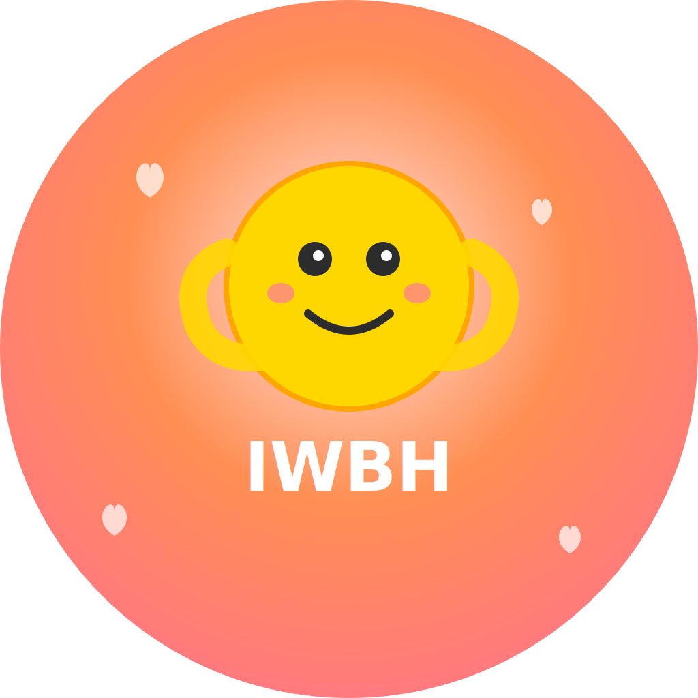

# IWBH - I Wanna Be Held 💕

<div align="center">
  
  
  **A beautifully crafted iOS app for couples to grow together** ✨
  
  Built with SwiftUI | Designed with love | Made for iOS 16+
  
  [Download on App Store](#) • [View Screenshots](#screenshots) • [Join Community](#support)
</div>

---

## 🌟 Overview

IWBH (I Wanna Be Held) is a comprehensive relationship companion that combines habit tracking, AI-powered coaching, and meaningful activities to help couples strengthen their bond. With its clean, Apple-inspired interface and intelligent features, IWBH makes relationship growth feel natural and engaging.

## ✨ Features

### 🤖 AI Dating Coach (Nova)
- **Intelligent Conversations**: Chat with Nova, your personal AI dating coach powered by GPT-4
- **Image Support**: Share photos and get contextual advice about relationship situations
- **Conversation Management**: Save, organize, and revisit important conversations
- **Previous Chats**: Browse and search through your chat history
- **Conversation Starters**: Get prompts organized by category (Relationship Advice, Dating Tips, Personal Growth, Communication)
- **Share & Export**: Export conversations or share them with your partner
- **Theme Tags**: AI automatically categorizes conversations by themes like communication, trust, conflict resolution
- **Weekly Summaries**: Get AI-generated insights about your relationship progress
- **Relationship Context**: Coach learns about your relationship details for personalized advice

### 🎯 Advanced Habit Tracking
- **Smart Tracker Types**: Streaks, counters, timers, and negative event tracking
- **Relationship-Focused Templates**: Pre-built trackers for common relationship challenges
  - Days without fighting, arguing about money, bringing up exes
  - Positive trackers for date nights, compliments, acts of kindness
  - Personal growth trackers for meditation, exercise, reading
- **Goal Setting & Progress**: Visual progress tracking with charts and percentages
- **Detailed History**: Track every entry with notes and timestamps
- **Streak Management**: Automatic streak calculation and longest streak records
- **Primary Tracker**: Highlight your most important tracker on the home screen

### 👥 Partner Connection & Profiles
- **Secure Pairing System**: Connect with your partner using 6-digit codes
- **Rich User Profiles**: Customizable profiles with emojis, bios, and interests
- **Love Languages**: Set and display your love language preferences
- **Interest Tags**: Add and manage personal interests with a flowing tag layout
- **Connection Status**: Real-time partner connection monitoring
- **Guest Mode**: Use the app without creating an account

### 💖 Guided Relationship Activities
- **Curated Activity Library**: Professional relationship activities organized by category
  - Communication & Connection (Daily Check-ins, Love Language Sessions)
  - Fun & Playful (Kitchen Dancing, Memory Lane Walks)
  - Stress Relief (5-Minute Meditations, Gratitude Exchanges)
  - Quality Time (Sunset Watching, Creative Projects)
- **Detailed Instructions**: Step-by-step guidance with pro tips for each activity
- **Progress Tracking**: Mark activities as completed and build a history
- **Duration Estimates**: Know how much time each activity requires

### 📱 iOS Widget Integration
- **Home Screen Widgets**: Quick access to your primary tracker directly from your home screen
- **Multiple Sizes**: Support for small, medium, and large widget configurations
- **Real-time Updates**: Widgets automatically update to show current progress
- **Live Activities**: Dynamic Island support for active tracking sessions

### 🎨 Premium UI & User Experience
- **Apple Design Language**: Native iOS design following Human Interface Guidelines
- **Fluid Animations**: Smooth spring animations and micro-interactions throughout
- **Haptic Feedback**: Contextual vibrations for actions and responses
- **Accessibility First**: Full VoiceOver support and Dynamic Type compatibility
- **Dark Mode**: Seamless adaptation to system appearance preferences
- **Blur Effects**: Modern translucent materials for depth and elegance

### 🔒 Privacy & Security
- **Multiple Authentication Options**: Apple Sign In, Email/Password, or Guest Mode
- **Local Data Storage**: Chat messages and tracker data stored locally with UserDefaults
- **Cloud Backup**: Optional Firebase integration for data synchronization
- **Secure File Handling**: S3 integration for image uploads with proper encryption
- **No Data Mining**: Your personal relationship data stays private

## 🚀 Getting Started

### Prerequisites
- Xcode 15.0 or later
- iOS 16.0 or later
- Swift 5.9 or later
- Node.js 18+ for backend

**📖 For detailed setup instructions, see [Development Setup Guide](docs/DEVELOPMENT_SETUP.md)**

### Quick Installation

1. Clone the repository:
```bash
git clone https://github.com/yourusername/IWBH.git
cd IWBH
```

2. **iOS App Setup:**
   - Open `ios-app/IWBH.xcodeproj` in Xcode 15.0 or later
   - Ensure iOS 16.0+ deployment target
   - Build and run on device or simulator

3. **Backend Setup (Required for AI Chat):**
   ```bash
   cd backend
   npm install
   ```
   
4. **Environment Configuration:**
   - Create `.env` file in backend directory:
   ```env
   OPENAI_API_KEY=your_openai_api_key
   AWS_ACCESS_KEY_ID=your_aws_access_key
   AWS_SECRET_ACCESS_KEY=your_aws_secret_key
   AWS_REGION=us-east-1
   ```

5. **Run the Backend:**
   ```bash
   npm run dev  # Development mode
   npm start    # Production mode
   ```

6. **Update iOS App Configuration:**
   - In `ios-app/IWBH/Services/ChatService.swift`, update the base URL to your backend server
   - For local development: `http://localhost:3000`

## 🏗️ Architecture

**📖 For detailed project structure, see [Project Structure Guide](docs/PROJECT_STRUCTURE.md)**

The app follows MVVM architecture with SwiftUI and includes a Node.js backend:

```
IWBH/
├── ios-app/                # iOS Application
│   ├── IWBH/               # Main iOS app source code
│   │   ├── Models/         # Data models and business logic
│   │   │   ├── AuthenticationModel.swift
│   │   │   ├── CustomTrackersModel.swift
│   │   │   ├── PartnerConnectionModel.swift
│   │   │   └── UserProfileModel.swift
│   │   ├── Views/          # SwiftUI views and UI components
│   │   │   ├── MainView.swift
│   │   │   ├── ChatView.swift
│   │   │   ├── TrackersView.swift
│   │   │   ├── ProfileView.swift
│   │   │   └── ActivitiesView.swift
│   │   ├── Services/       # API communication
│   │   │   └── ChatService.swift
│   │   └── Assets.xcassets/ # App icons and images
│   ├── TrackerWidgetExtension/ # iOS Widgets
│   ├── IWBHTests/          # Unit tests
│   ├── IWBHUITests/        # UI tests
│   └── IWBH.xcodeproj/     # Xcode project file
├── backend/                # Node.js API Server
│   ├── services/           # Business logic
│   │   └── chatService.js
│   ├── routes/             # API endpoints
│   │   └── chatRoutes.js
│   ├── config/             # Configuration files
│   ├── package.json        # Node.js dependencies
│   └── server.js           # Express server
├── assets/                 # Static assets
│   └── AppIcons/           # App icons and branding
├── scripts/                # Utility scripts
│   ├── nuclear_secret_removal.sh
│   └── remove_env_from_history.sh
├── docs/                   # Documentation (future)
└── README.md               # Project documentation
```

### Key Components

- **ios-app/IWBH/Services/ChatService.swift**: Handles communication with AI coach backend
- **ios-app/IWBH/Models/CustomTrackersModel**: Manages habit tracking and local persistence
- **ios-app/IWBH/Models/PartnerConnectionModel**: Handles partner pairing and connection status
- **ios-app/IWBH/Models/UserProfileModel**: Manages user profiles and preferences
- **backend/services/chatService.js**: Backend service for OpenAI integration and data storage

## 🎨 Customization

### Adding New Tracker Templates
Edit `ios-app/IWBH/Models/CustomTrackersModel.swift` to add new predefined tracker templates:

```swift
TrackerTemplate(
    name: "Your Custom Tracker",
    emoji: "🎯",
    color: "blue",
    trackingType: .counter,
    unit: "times",
    goal: 30,
    description: "Track your custom habit"
)
```

### Adding New Activities
Edit `ios-app/IWBH/Views/ActivitiesView.swift` to add new relationship activities:

```swift
Activity(
    title: "Your Activity",
    description: "Detailed instructions...",
    category: "Quality Time",
    emoji: "💕",
    duration: "30 mins"
)
```

## 🤝 Contributing

We welcome contributions! Please follow these steps:

1. Fork the repository
2. Create a feature branch (`git checkout -b feature/amazing-feature`)
3. Commit your changes (`git commit -m 'Add amazing feature'`)
4. Push to the branch (`git push origin feature/amazing-feature`)
5. Open a Pull Request

### Code Style
- Follow Swift naming conventions
- Use SwiftUI best practices
- Add comments for complex logic
- Ensure proper error handling

## 📱 Screenshots

<div align="center">
  
  
  
  
</div>

*Beautiful, intuitive interfaces designed with Apple's design principles*

## 🛠️ Tech Stack & Architecture

### Frontend (iOS App)
- **SwiftUI** - Modern declarative UI framework
- **Combine** - Reactive programming and data flow
- **WidgetKit** - Home screen widgets and Live Activities
- **SF Symbols** - Apple's comprehensive icon library
- **UserDefaults** - Local data persistence for chats and trackers
- **URLSession** - HTTP networking for backend communication

### Backend (Node.js API)
- **Node.js & Express** - RESTful API server with HTTPS support
- **OpenAI GPT-4** - AI-powered dating coach conversations
- **AWS DynamoDB** - Chat history and user data storage
- **AWS S3** - File and image storage with secure uploads
- **Helmet & CORS** - Security middleware and cross-origin handling

### Authentication & Security
- **Apple Sign In** - Native iOS authentication
- **Email/Password** - Custom authentication system
- **Guest Mode** - Anonymous usage without account creation
- **Environment-based Configuration** - Secure API key management

### Architecture Highlights
- **MVVM Pattern**: Clean separation of concerns in iOS app
- **Reactive Data Flow**: Combine-based state management  
- **Environment Objects**: Shared state across SwiftUI views
- **RESTful API Design**: Clean backend endpoints for chat and data sync
- **Accessibility First**: Built-in VoiceOver and Dynamic Type support

## 🚀 Roadmap & Future Features

- [ ] **Apple Watch App** - Native watchOS companion with complications
- [ ] **Advanced Analytics** - Relationship insights and progress visualization  
- [ ] **Siri Shortcuts** - Voice-activated habit tracking
- [ ] **Enhanced AI Coach** - Context-aware responses with relationship timeline
- [ ] **Social Features** - Anonymous community sharing (optional)
- [ ] **Advanced File Support** - Video uploads and voice messages
- [ ] **Localization** - Support for 10+ languages
- [ ] **iMessage Extension** - In-chat activity suggestions
- [ ] **CloudKit Sync** - Cross-device data synchronization
- [ ] **Premium Features** - Advanced coaching and unlimited chat history

## 📄 License

This project is licensed under the MIT License - see the [LICENSE](LICENSE) file for details.

## 🙏 Acknowledgments

- Thanks to all couples who provided feedback during development
- Inspired by relationship psychology research
- Icons and emojis from Apple's SF Symbols

## 📞 Support

If you encounter any issues or have questions:

- Create an issue on GitHub
- Contact us at support@iwbhapp.com
- Join our community Discord

---

**Made with ❤️ for couples who want to grow together**

*Remember: The goal isn't perfection, it's progress. Every small step counts in building a stronger, happier relationship.*
