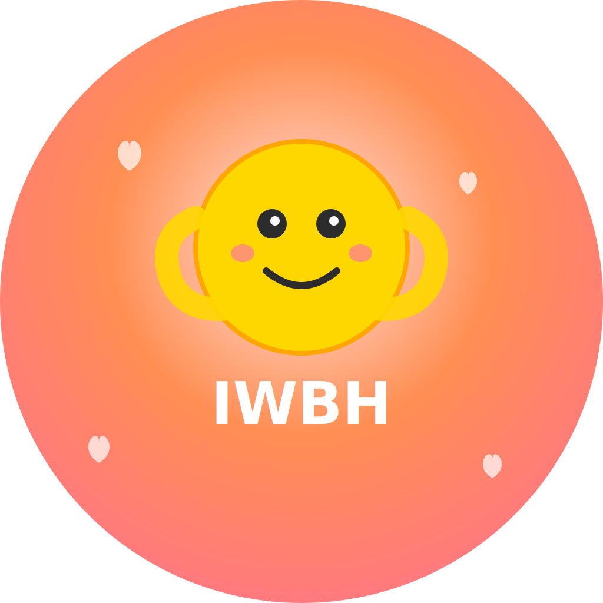

# IWBH - I Will Be Happy 💕

<div align="center">
  
  
  **A beautifully crafted iOS app for couples to grow together** ✨
  
  Built with SwiftUI | Designed with love | Made for iOS 16+
  
  [Download on App Store](#) • [View Screenshots](#screenshots) • [Join Community](#support)
</div>

---

## 🌟 Overview

IWBH (I Will Be Happy) is a thoughtfully designed relationship companion that helps couples strengthen their bond through meaningful habits, shared activities, and genuine connection. With its clean, Apple-inspired interface and smooth animations, IWBH makes relationship growth feel natural and engaging.

## ✨ Features

### 🎯 Custom Habit Tracking
- Create personalized trackers for relationship habits
- Track positive behaviors like date nights, compliments, and acts of kindness
- Monitor negative events like arguments or missed commitments
- Set goals and visualize progress with beautiful charts
- Different tracking types: streaks, counters, timers, and event tracking

### 👥 Partner Connection
- Secure pairing system using unique codes
- Real-time synchronization between partners
- See your partner's progress and celebrate together
- Connection status and health monitoring

### 💖 Relationship Activities
- Curated collection of relationship-building activities
- Categorized by Communication, Fun, Stress Relief, and Quality Time
- Step-by-step guidance for each activity
- Track completed activities and build memories

### 🎨 Beautiful UI & User Experience
- **Apple Design Language**: Clean, intuitive interface following Apple's Human Interface Guidelines
- **Fluid Animations**: Smooth spring animations and micro-interactions
- **Dynamic Themes**: Customizable color schemes and visual styles
- **Accessibility First**: Full VoiceOver support and Dynamic Type compatibility
- **Dark Mode**: Seamless dark/light mode adaptation
- **Haptic Feedback**: Subtle tactile responses for enhanced interaction

### 🔒 Privacy & Security
- Local data storage with optional cloud sync
- Secure authentication with Firebase
- Guest mode for privacy-conscious users
- No personal data shared with third parties

## 🚀 Getting Started

### Prerequisites
- Xcode 15.0 or later
- iOS 16.0 or later
- Swift 5.9 or later

### Installation

1. Clone the repository:
```bash
git clone https://github.com/yourusername/IWBH.git
cd IWBH
```

2. Open the project in Xcode:
```bash
open IWBH.xcodeproj
```

3. Add your Firebase configuration:
   - Create a new Firebase project at [Firebase Console](https://console.firebase.google.com)
   - Download `GoogleService-Info.plist`
   - Add it to the IWBH target in Xcode

4. Build and run the project:
   - Select your target device or simulator
   - Press `Cmd + R` to build and run

## 🏗️ Architecture

The app follows MVVM architecture with SwiftUI:

```
IWBH/
├── Models/                 # Data models and business logic
│   ├── AuthenticationModel.swift
│   ├── CustomTrackersModel.swift
│   ├── PartnerConnectionModel.swift
│   └── UserProfileModel.swift
├── Views/                  # SwiftUI views and UI components
│   ├── HomeView.swift
│   ├── TrackersView.swift
│   ├── ProfileView.swift
│   └── ActivitiesView.swift
├── Widgets/               # iOS widgets
└── Assets.xcassets/       # App icons and images
```

### Key Components

- **AuthenticationModel**: Handles user authentication and guest mode
- **CustomTrackersModel**: Manages habit tracking and data persistence
- **PartnerConnectionModel**: Handles partner pairing and real-time sync
- **UserProfileModel**: Manages user profiles and preferences

## 🎨 Customization

### Adding New Tracker Templates
Edit `CustomTrackersModel.swift` to add new predefined tracker templates:

```swift
TrackerTemplate(
    name: "Your Custom Tracker",
    emoji: "🎯",
    color: "blue",
    trackingType: .counter,
    unit: "times",
    goal: 30,
    description: "Track your custom habit"
)
```

### Adding New Activities
Edit `ActivitiesView.swift` to add new relationship activities:

```swift
Activity(
    title: "Your Activity",
    description: "Detailed instructions...",
    category: "Quality Time",
    emoji: "💕",
    duration: "30 mins"
)
```

## 🤝 Contributing

We welcome contributions! Please follow these steps:

1. Fork the repository
2. Create a feature branch (`git checkout -b feature/amazing-feature`)
3. Commit your changes (`git commit -m 'Add amazing feature'`)
4. Push to the branch (`git push origin feature/amazing-feature`)
5. Open a Pull Request

### Code Style
- Follow Swift naming conventions
- Use SwiftUI best practices
- Add comments for complex logic
- Ensure proper error handling

## 📱 Screenshots

<div align="center">
  
  
  
  
</div>

*Beautiful, intuitive interfaces designed with Apple's design principles*

## 🛠️ Tech Stack & Architecture

- **SwiftUI** - Modern declarative UI framework
- **Firebase** - Authentication and real-time synchronization
- **Combine** - Reactive programming and data flow
- **Core Data** - Local data persistence (optional)
- **SF Symbols** - Apple's comprehensive icon library
- **UserDefaults** - Lightweight local storage
- **CloudKit** - iCloud synchronization (coming soon)

### Architecture Highlights
- **MVVM Pattern**: Clean separation of concerns
- **Reactive Data Flow**: Combine-based state management  
- **Environment Objects**: Shared state across views
- **Accessibility First**: Built-in VoiceOver and Dynamic Type support

## 📱 Screenshots

<div align="center">
  
  
  
  
</div>

*Beautiful, intuitive interfaces designed with Apple's design principles*

## 🚀 Roadmap & Future Features

- [ ] **Apple Watch App** - Native watchOS companion with complications
- [ ] **Advanced Analytics** - Relationship insights and progress visualization  
- [ ] **Siri Shortcuts** - Voice-activated habit tracking
- [ ] **WidgetKit Integration** - Home screen widgets for quick access
- [ ] **Social Features** - Anonymous community sharing (optional)
- [ ] **Relationship Coaching** - Expert-curated content and tips
- [ ] **Localization** - Support for 10+ languages
- [ ] **iMessage Extension** - In-chat activity suggestions
- [ ] **Apple Pay Integration** - Seamless in-app purchases for premium features

## 📄 License

This project is licensed under the MIT License - see the [LICENSE](LICENSE) file for details.

## 🙏 Acknowledgments

- Thanks to all couples who provided feedback during development
- Inspired by relationship psychology research
- Icons and emojis from Apple's SF Symbols

## 📞 Support

If you encounter any issues or have questions:

- Create an issue on GitHub
- Contact us at support@iwbhapp.com
- Join our community Discord

---

**Made with ❤️ for couples who want to grow together**

*Remember: The goal isn't perfection, it's progress. Every small step counts in building a stronger, happier relationship.*